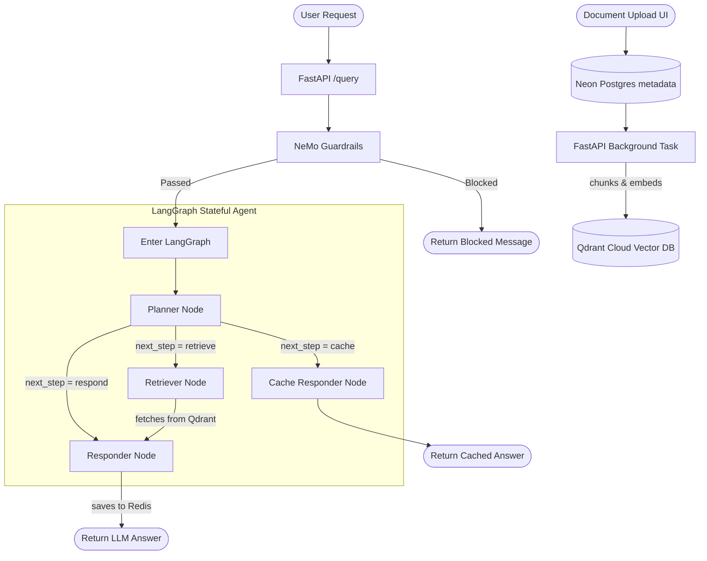

# 🧠 Agentic RAG


An enterprise-grade, stateful Agentic Retrieval-Augmented Generation (RAG) system. This project leverages intelligent AI agents to route queries, retrieve context from massive document stores, cache semantic answers, and block adversarial inputs.

## ✨ Features

- **Agentic Routing (LangGraph):** Stateful agents dynamically route queries between L1 Semantic Cache, Qdrant Vector Search, or conversational memory.
- **Enterprise Guardrails:** NVIDIA NeMo Guardrails intercept and block adversarial prompts, jailbreaks, and off-topic queries before they hit the LLM.
- **Semantic Caching:** Redis Enterprise Cloud caches previous answers, returning instant results for repeated or semantically identical questions.
- **Serverless PostgreSQL:** Neon Postgres tracks document ingestion status and provides persistent memory (checkpoints) for the LangGraph agents.
- **Evaluation Dashboard:** A dedicated Streamlit UI utilizing RAGAS to continuously evaluate Faithfulness, Answer Relevancy, and Context Precision.
- **Cloud-Ready CI/CD:** Fully containerized with Docker, optimized with BuildKit caching, and ready for serverless deployment on AWS Fargate via GitHub Actions.

---

## 🏗️ Architecture



---

## 💻 Tech Stack

- **Framework:** FastAPI
- **AI & Agents:** LangChain, LangGraph
- **LLM Inference:** Groq (Llama 3 / Mixtral)
- **Vector Store:** Qdrant Cloud
- **Database (Metadata & State):** Neon PostgreSQL (Serverless)
- **Cache:** Redis Enterprise Cloud
- **Security:** NeMo Guardrails
- **Observability:** LangSmith
- **Evaluation:** Ragas & Streamlit
- **DevOps:** Docker Compose, AWS ECS Fargate, GitHub Actions

---

## 🚀 Getting Started (Local Development)

### Prerequisites
- [Docker & Docker Compose](https://www.docker.com/)
- API Keys for Groq, Qdrant Cloud, Neon Postgres, and Redis.

### 1. Environment Setup
Create a `.env` file in the root directory and populate it with your cloud credentials:

```env
OPENAI_API_KEY=your_key
GROQ_API_KEY=your_key
QDRANT_URL=your_qdrant_url
QDRANT_API_KEY=your_qdrant_key
DATABASE_URL=your_neon_postgres_url
REDIS_URL=your_redis_url
LANGCHAIN_API_KEY=your_langsmith_key
```

### 2. Run the Application
The project utilizes Docker BuildKit caching to ensure lightning-fast builds. 

```bash
docker-compose up --build
```

This will spin up two services:
1. **API Backend:** `http://localhost:8000/docs` (FastAPI Swagger UI)
2. **Evals Dashboard:** `http://localhost:8501` (Streamlit RAGAS Evaluation)

### 3. Ingesting Documents
You can ingest PDF, TXT, DOCX, or HTML files by opening the `index.html` frontend UI, or by directly calling the API endpoint:
```bash
curl -X POST "http://localhost:8000/api/documents" -F "file=@your_document.pdf"
```
The FastAPI background tasks will handle chunking, embedding, and syncing status to the Neon PostgreSQL database.

---

## ☁️ Deployment

This project is configured for a highly scalable, serverless deployment on **AWS ECS Fargate**.

For step-by-step AWS CLI deployment instructions and architectural strategies (Lean Startup vs. Enterprise), please refer to the [Deployment Guide](deployment.md).

Automated CI/CD is configured via `.github/workflows/deploy.yml`. Upon pushing to the `main` branch, GitHub Actions will build the Docker image and seamlessly update the Fargate instances.

---

## 🛡️ Security

This project contains highly sensitive API keys and database credentials in the `task-def.json` and `.env` files. Both of these files are securely ignored via `.gitignore` to prevent accidental leakage. **Never commit your `.env` or `task-def.json` files to source control.**
